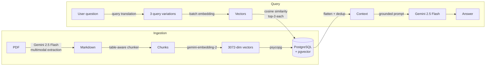

# pdf-rag-python

A retrieval-augmented generation (RAG) pipeline in Python that lets you ask questions about your PDF documents.

PDFs are extracted to Markdown with **Gemini 2.5 Flash** (multimodal, table-aware), split with a custom **table-aware Markdown chunker**, embedded with **Gemini embeddings**, and stored in **PostgreSQL + pgvector**. At query time, your question is expanded into multiple phrasings, searched via cosine similarity, deduplicated, and used to ground a Gemini answer — with **LangSmith** tracing every step.

## Features

- 🔍 **Multimodal PDF extraction** — Gemini Vision converts PDFs into clean Markdown, preserving headings, lists, and tables
- 📊 **Table-aware chunking** — custom chunker keeps tables intact (header re-attached to every split piece) with word-snapped overlap between chunks
- 🧠 **Multi-query retrieval** — Gemini rewrites your question into alternative phrasings to improve recall, and all variations are embedded in a single API call
- ⚡ **pgvector similarity search** — cosine distance (`<=>`) search over 3072-dimensional embeddings
- 🔁 **Incremental ingestion** — SHA-256 file hash tracking skips unchanged files and re-ingests changed ones
- 💬 **Grounded answers** — the LLM answers *only* from retrieved context, with an explicit "not found" fallback
- 📈 **LangSmith tracing** — every extraction, embedding, retrieval, and LLM call is traced
- 🐘 **Dockerized Postgres** — one-command pgvector setup via Docker Compose

## Architecture



## Project structure

```
pdf-rag-python/
├── docs/
│   └── Generative AI Primer - Bocconi.pdf  # Default PDF to ingest
├── src/
│   ├── ingest.py          # Ingestion pipeline: extract → chunk → embed → store
│   ├── chat.py            # Interactive chat: translate → embed → search → answer
│   ├── chunking.py        # Table-aware Markdown chunker
│   └── test_chunking.py   # Sanity tests for the chunker
├── docker-compose.yml     # Postgres 16 + pgvector
├── requirements.txt
├── .env.example           # Template for environment variables
└── .gitignore             # .env is gitignored (keep secrets local)
```

## Getting started

### Prerequisites

- Python 3.10+
- Docker (for Postgres + pgvector)
- A [Google AI Studio](https://aistudio.google.com/) API key
- (Optional) A [LangSmith](https://smith.langchain.com/) API key for tracing

### 1. Start the database

```bash
docker compose up -d
```

This runs `pgvector/pgvector:pg16` with a persistent volume.

### 2. Install dependencies

```bash
pip install -r requirements.txt
```

### 3. Configure environment variables

Create a `.env` file in the project root (copy `.env.example` as a starting template):

```dotenv
# Google Gemini
GOOGLE_API_KEY=your_google_api_key

# PostgreSQL (matches docker-compose.yml)
DB_PORT=5432
DB_USER=postgres
DB_PASSWORD=postgres
DB_NAME=postgres

# LangSmith tracing (optional)
LANGSMITH_TRACING=true
LANGSMITH_API_KEY=your_langsmith_api_key

# Target PDF to ingest (defaults to docs/Generative AI Primer - Bocconi.pdf in code)
PDF_FILE_PATH=docs/Generative AI Primer - Bocconi.pdf
```

### 4. Ingest a PDF

```bash
python src/ingest.py
```

By default this ingests `docs/Generative AI Primer - Bocconi.pdf`. To ingest a different PDF (e.g. a private document), set `PDF_FILE_PATH` in your local `.env` - no code changes needed (see `FILE_PATH` in `src/ingest.py`). The pipeline:

1. Enables the `vector` extension and creates the `ingested_files` / `document_vectors` tables
2. Computes the file's SHA-256 hash — skips if unchanged, purges old vectors if changed
3. Extracts the PDF to Markdown with Gemini Vision
4. Chunks it (1000 chars, 200 overlap) with the table-aware chunker
5. Embeds each chunk and stores everything in pgvector

Run it again after editing the PDF — only the changed file is re-processed.

### 5. Ask questions

```bash
python src/chat.py
```

```
Connected to database. Ready to query!

Ask a question about the PDF (or type 'exit'): what is the notice period?
```

### Run the chunker tests

```bash
python src/test_chunking.py
```

## How it works

### Query pipeline

1. **Query translation** — Gemini 2.5 Flash generates 2 alternative phrasings of your question (e.g. `generative AI` → `artificial intelligence`, `AI foundations`)
2. **Batch embedding** — all query variations are embedded in one API call
3. **Similarity search** — top-3 nearest chunks per variation using pgvector's cosine distance operator (`<=>`)
4. **Deduplication** — results are deduplicated by content using a dict comprehension
5. **Grounded answer** — Gemini answers using *only* the retrieved snippets; if the answer isn't in them, it responds with *"I cannot find that information inside the uploaded document."*

### Table-aware chunker

A naive chunker can split a Markdown table mid-row, leaving pieces with no column headers. This chunker:

- Detects table blocks (lines starting with `|`) and keeps them as self-contained chunks
- Splits oversized tables **by row**, re-attaching the header row to every piece so each chunk stays self-describing
- Carries word-snapped overlap between prose chunks, and propagates the table's tail rows as overlap into the following prose so context isn't lost at boundaries

## Configuration

| What | Where | Default |
|------|-------|---------|
| Target PDF | `PDF_FILE_PATH` in `.env` | `docs/Generative AI Primer - Bocconi.pdf` |
| Chunk size / overlap | `markdown_aware_chunk(...)` call in `src/ingest.py` | `1000` / `200` |
| Results per query | `limit` in `run_rag_pipeline` (`src/chat.py`) | `3` |
| LLM model | `model=` in `src/chat.py` / `src/ingest.py` | `gemini-2.5-flash` |
| Embedding model | `model=` in `_embed_text` / `_embed_questions` | `gemini-embedding-2` |
| Vector dimensions | `vector(3072)` in `src/ingest.py` | `3072` |

> Note: if you change the embedding model, update the `vector(3072)` column type to match the new model's dimensionality and re-ingest.

## Tech stack

- [google-genai](https://pypi.org/project/google-genai/) — Gemini 2.5 Flash + embeddings
- [PostgreSQL](https://www.postgresql.org/) + [pgvector](https://github.com/pgvector/pgvector) — vector storage and similarity search
- [psycopg 3](https://www.psycopg.org/psycopg3/) + connection pooling — Postgres driver
- [LangSmith](https://smith.langchain.com/) — observability and tracing
- [Docker Compose](https://docs.docker.com/compose/) — one-command database setup
