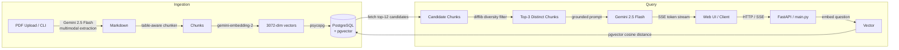

# pdf-rag-python

A retrieval-augmented generation (RAG) pipeline in Python that lets you ask questions about your PDF documents.

PDFs are extracted to Markdown with **Gemini 2.5 Flash** (multimodal, table-aware), split with a custom **table-aware Markdown chunker**, embedded with **Gemini embeddings**, and stored in **PostgreSQL + pgvector**. At query time, your question is expanded into multiple phrasings, searched via cosine similarity, deduplicated, and used to ground a Gemini answer — with **LangSmith** tracing every step.

## Features

- 🌐 **FastAPI Web Service & SSE Streaming** — REST API endpoints for ingestion and chat, plus real-time token streaming using Server-Sent Events (SSE)
- 🖥️ **Interactive Web UI** — responsive browser chat interface with real-time token typing effect, blinking cursor, source chunk inspection, and error handling
- 🔍 **Multimodal PDF extraction** — Gemini Vision converts PDFs into clean Markdown, preserving headings, lists, and tables
- 📊 **Table-aware chunking** — custom chunker keeps tables intact (header re-attached to every split piece) with word-snapped overlap between chunks
- 🧠 **Multi-query retrieval & Diversity Filtering** — vector search combined with `difflib` similarity filtering to avoid near-duplicate chunks crowding top results
- ⚡ **pgvector similarity search** — cosine distance (`<=>`) search over 3072-dimensional embeddings
- 🔁 **Incremental ingestion** — SHA-256 file hash tracking skips unchanged files and re-ingests changed ones
- 💬 **Grounded answers** — the LLM answers *only* from retrieved context, with an explicit "not found" fallback
- 📈 **LangSmith tracing** — every extraction, embedding, retrieval, and LLM call is traced
- 🐘 **Dockerized Postgres** — one-command pgvector setup via Docker Compose

## Architecture


```mermaid
flowchart LR
    subgraph Ingestion
        A[PDF Upload / CLI] -->|Gemini 2.5 Flash<br>multimodal extraction| B[Markdown]
        B -->|table-aware chunker| C[Chunks]
        C -->|gemini-embedding-2| D[3072-dim vectors]
        D -->|psycopg| E[(PostgreSQL<br>+ pgvector)]
    end
    subgraph Query
        F[Web UI / Client] -->|HTTP / SSE| G[FastAPI / main.py]
        G -->|embed question| H[Vector]
        H -->|pgvector cosine distance| E
        E -->|fetch top-12 candidates| I[Candidate Chunks]
        I -->|difflib diversity filter| J[Top-3 Distinct Chunks]
        J -->|grounded prompt| K[Gemini 2.5 Flash]
        K -->|SSE token stream| F
    end
```

## Project structure

```
pdf-rag-python/
├── docs/
│   └── Generative AI Primer - Bocconi.pdf  # Default PDF to ingest
├── src/
│   ├── main.py            # FastAPI application (REST endpoints, SSE streaming, connection pool)
│   ├── ingest.py          # Ingestion pipeline: extract → chunk → embed → store
│   ├── chat.py            # CLI chat: translate → embed → search → answer
│   ├── chunking.py        # Table-aware Markdown chunker
│   └── test_chunking.py   # Sanity tests for the chunker
├── static/
│   └── index.html         # Frontend web UI (Server-Sent Events reader, typing animation)
├── docker-compose.yml     # Postgres 16 + pgvector
├── pyproject.toml          # Project declaration - dependencies live here
├── uv.lock                 # Locked dependency graph - reproducible installs
├── .env.example           # Template for environment variables
└── .gitignore             # .env is gitignored (keep secrets local)
```

## Getting started

### Prerequisites

- [uv](https://docs.astral.sh/uv/) - manages Python, the venv, and dependencies (it can even install Python: `uv python install 3.12`)
- Docker (for Postgres + pgvector)
- A [Google AI Studio](https://aistudio.google.com/) API key
- (Optional) A [LangSmith](https://smith.langchain.com/) API key for tracing

### 1. Start the database

```bash
docker compose up -d
```

This runs `pgvector/pgvector:pg16` with a persistent volume.

### 2. Install dependencies

```bash
uv sync
```

This creates `.venv` and installs the exact locked environment from `uv.lock`.

### 3. Configure environment variables

Create a `.env` file in the project root (copy `.env.example` as a starting template):

```dotenv
# Google Gemini
GOOGLE_API_KEY=your_google_api_key

# PostgreSQL (matches docker-compose.yml)
DB_PORT=5432
DB_USER=postgres
DB_PASSWORD=postgres
DB_NAME=postgres

# LangSmith tracing (optional)
LANGSMITH_TRACING=true
LANGSMITH_API_KEY=your_langsmith_api_key

# Target PDF to ingest via CLI (defaults to docs/Generative AI Primer - Bocconi.pdf)
PDF_FILE_PATH=docs/Generative AI Primer - Bocconi.pdf
```

### 4. Run the Web Application (Recommended)

Start the FastAPI server:

```bash
uv run uvicorn src.main:app --reload
```

Open your browser at **[http://127.0.0.1:8000](http://127.0.0.1:8000)** to use the chat UI with real-time streaming answers and sources!

---

### Alternative: CLI Ingestion & Chat

#### Ingest a PDF via CLI

```bash
uv run python src/ingest.py
```

By default this ingests `docs/Generative AI Primer - Bocconi.pdf`. To ingest a different PDF, set `PDF_FILE_PATH` in `.env`.

#### Chat via CLI

```bash
uv run python src/chat.py
```

```
Connected to database. Ready to query!

Ask a question about the PDF (or type 'exit'): what is the notice period?
```

### Run the chunker tests

```bash
uv run python src/test_chunking.py
```

## API Endpoints

FastAPI provides interactive Swagger documentation at `http://127.0.0.1:8000/docs`.

| Method | Endpoint | Description |
|---|---|---|
| `GET` | `/` | Serves the browser web chat UI (`static/index.html`) |
| `POST` | `/api/chat/stream` | Streams answer tokens in real-time via Server-Sent Events (SSE) |
| `POST` | `/api/chat` | Standard JSON endpoint returning full answer and source chunks |
| `POST` | `/api/ingest` | Multipart file upload to ingest and index a PDF on the fly |

## How it works

### Query & Streaming Pipeline

1. **Embedding**: The user's query is converted to a 3072-dimensional vector with `gemini-embedding-2`.
2. **pgvector Retrieval**: Cosine distance search (`<=>`) retrieves the top 12 candidate chunks from Postgres.
3. **Diversity & Deduplication (`difflib`)**: Chunks from near-identical documents or repeated clauses are filtered using `difflib.SequenceMatcher` to prevent redundant passages from crowding the top-3 context window.
4. **SSE Event Stream**:
   - Sends the retrieved source metadata first (`data: {"sources": [...]}`).
   - Streams LLM generated tokens one by one (`data: {"token": "..."}`).
   - Yields `data: [DONE]` on completion (or `data: {"error": "..."}` on exceptions).

### Table-aware chunker

A naive chunker can split a Markdown table mid-row, leaving pieces with no column headers. This chunker:

- Detects table blocks (lines starting with `|`) and keeps them as self-contained chunks
- Splits oversized tables **by row**, re-attaching the header row to every piece so each chunk stays self-describing
- Carries word-snapped overlap between prose chunks, and propagates the table's tail rows as overlap into the following prose so context isn't lost at boundaries

## Configuration

| What | Where | Default |
|------|-------|---------|
| Target PDF | `PDF_FILE_PATH` in `.env` | `docs/Generative AI Primer - Bocconi.pdf` |
| Chunk size / overlap | `markdown_aware_chunk(...)` call in `src/ingest.py` | `1000` / `200` |
| Results per query | `limit` in `run_rag_pipeline` (`src/chat.py`) | `3` |
| LLM model | `model=` in `src/chat.py` / `src/ingest.py` / `src/main.py` | `gemini-2.5-flash` |
| Embedding model | `model=` in `_embed_text` / `_embed_questions` | `gemini-embedding-2` |
| Vector dimensions | `vector(3072)` in `src/ingest.py` | `3072` |

> Note: if you change the embedding model, update the `vector(3072)` column type to match the new model's dimensionality and re-ingest.

## Tech stack

- **FastAPI** + **Uvicorn** — modern async web framework & ASGI server
- **Server-Sent Events (SSE)** — lightweight real-time token streaming
- **google-genai** — Gemini 2.5 Flash + embeddings
- **PostgreSQL** + **pgvector** — vector storage and cosine distance similarity search
- **psycopg 3** + `psycopg-pool` — connection pooling for high-throughput database queries
- **LangSmith** — observability and tracing
- **Docker Compose** — one-command database setup
